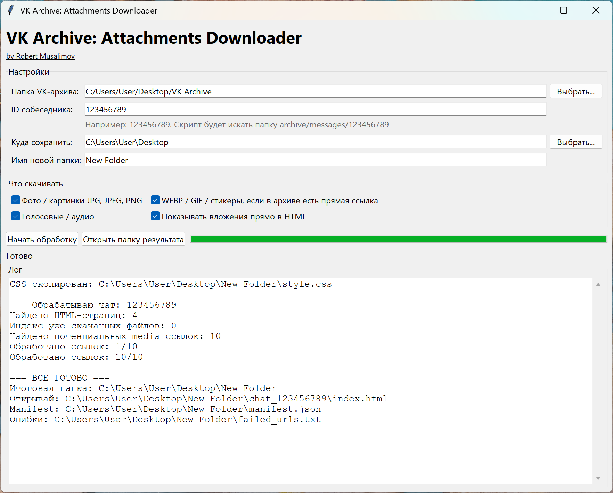

## VK Archive Attachments Downloader

<p align="right">
  <a href="README.ru.md">
    
  </a>
</p>

A tool for downloading attachments from a specific chat in a downloaded VK archive.

> **NB** VK is a popular Russian social networking platform

The tool finds external attachment links inside the archive’s HTML files, downloads images/audio locally, and, if needed, replaces external links in `index.html` with local files.

A downloaded VK archive and the chat/dialog ID are required.

> This is useful because external attachment links may stop working approximately 180 days after a chat or profile is deleted. After saving the attachments locally, you can delete the chat/profile without worrying that the media files will disappear.

## Screenshot

<p align="center">
  
</p>

## What the project does

VK Archive: Attachments Downloader is designed for users who have already downloaded their VK data archive and want to preserve chat attachments in a more convenient offline format.

The tool can:

* open a local VK archive folder;
* process a selected chat by dialog ID;
* find media links inside `messages*.html` files;
* download images, GIF/WebP files, stickers, and audio attachments;
* save downloaded files into a structured folder;
* rewrite exported HTML pages so they point to local files;
* optionally display attachments directly inside the generated HTML pages;
* create an `index.html` page for easier chat navigation;
* save a `manifest.json` file to avoid downloading the same files again;
* save failed download links into `failed_urls.txt`.

### Main features

* Graphical interface built with Tkinter
* Local VK archive processing
* Image support: JPG, JPEG, PNG
* WebP, GIF, and sticker support if direct links are present in the archive
* Audio and voice message support: OGG, MP3, M4A, AAC, WAV
* Ability to continue processing without re-downloading already saved files using `manifest.json`
* Progress bar and log window
* Improved interface sharpness on Windows through DPI awareness
* No server-side data processing

### Privacy

The program runs locally on your computer.  
It does not upload your VK archive, messages, attachments, or personal files to external servers.

However, when downloading attachments, the program sends requests to the original media links that are already present inside the exported VK archive.

### Requirements

* Python 3.9 or newer
* Windows is recommended for the current version of the interface
* A downloaded VK data archive on your computer

Install dependencies:

```bash
pip install -r requirements.txt
````

### How to run

```bash
python vk_archive_gui.py
```

### How to use

1. Download your VK data archive.
2. Extract the archive to a folder on your computer.
3. Run the program.
4. Select the root folder of the VK archive.
5. Enter the dialog ID you want to process.
6. Choose the folder where the result should be saved.
7. Select the attachment types you want to download.
8. Click **Start processing**.
9. Open the generated `index.html` file in the output folder.

## License

MIT License.

## Author

by Robert Musalimov
